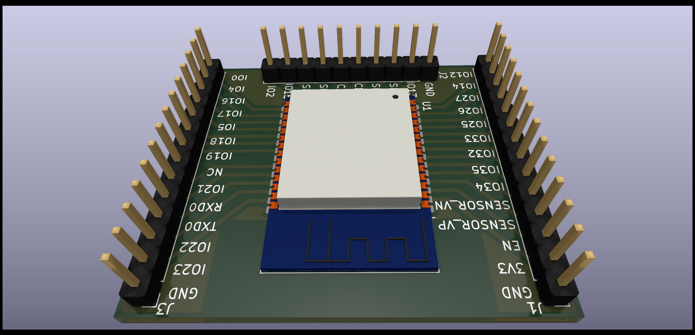

<!-- 
SPDX-FileCopyrightText: Copyright (c) 2021-2022 Sidings Media 

SPDX-License-Identifier: CC-BY-SA-4.0
-->
# ESP32-WROOM-32D Breakout boards
This project provides schematics for adaptor boards for the
ESP21-WROOM-32D. There are no components other that the WROOM module
included on the PCB.

## Licence
This repo uses the [REUSE](https://reuse.software) standard in order to
communicate the correct licence for the file. For those unfamiliar with
the standard the licence for each file can be found in one of three
places. The licence will either be in a comment block at the top of the
file, in a `.license` file with the same name as the file, or in the
dep5 file located in the `.reuse` directory. If you are unsure of the
licencing terms please contact
[contact@sidingsmedia.com](mailto:contact@sidingsmedia.com?subject=SMRC%20Licence).
All files committed to this repo must contain valid licencing
information or the pull request can not be accepted.
